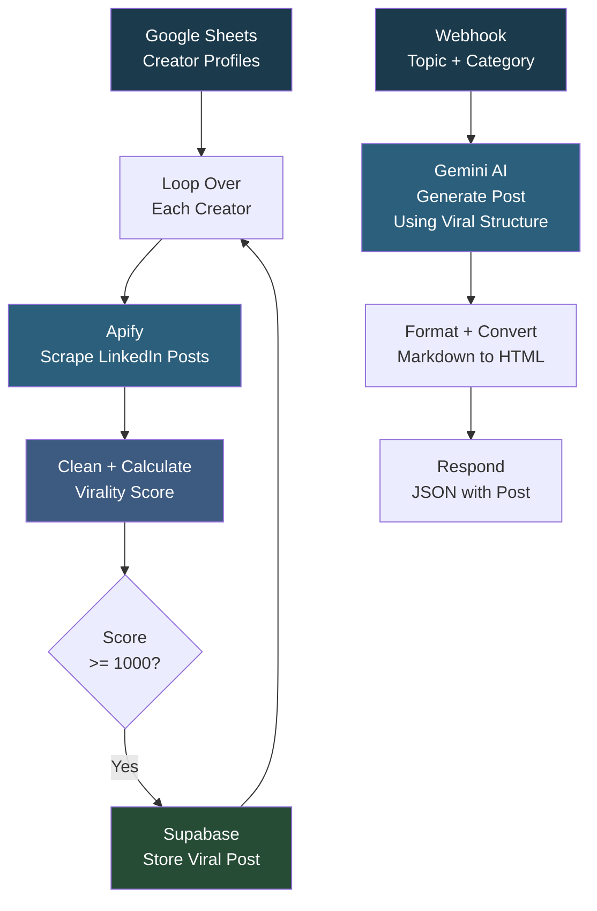

# LinkedIn Post Content Generation

## Overview

This workflow has two functions: (1) scraping viral LinkedIn posts from content creators, scoring them by virality, and storing the best ones in a Supabase database, and (2) generating new LinkedIn posts on demand using those viral posts as structural inspiration. The scraping pipeline reads creator profile URLs from a Google Sheet, pulls their recent posts via Apify, calculates a weighted virality score based on reactions, comments, and reposts, and stores posts above a threshold in Supabase. The generation pipeline receives a topic and category via webhook, retrieves a matching viral sample, and uses a Gemini AI agent to write a new post that follows the same structural patterns.

## How It Works

**Viral Post Scraping:**
```
Google Sheets (creator profiles) -> Loop over each -> Apify (scrape posts) -> Clean data -> Calculate virality score (weighted: reposts 10x, comments 5x, reactions 1-2x) -> Filter score >= 1000 -> Store in Supabase
```

**Post Generation (webhook):**
```
Webhook (POST with topic, category, selected sample) -> Gemini AI Agent (generate post using viral structure) -> Format as HTML -> Return JSON response
```

### Workflow Diagram



## Integrations

- **Google Sheets** - Content creator profile URLs
- **Apify** - LinkedIn profile post scraper
- **Supabase** - Viral posts database (viral_posts_new table)
- **Google Gemini** - AI post generation agent

## Setup

1. Import `Linkedin_Post_Content_Generation.json` into your n8n instance.
2. Configure credentials for Google Sheets, Supabase, and Google Gemini.
3. Update the Apify API token in the HTTP Request node.
4. Populate the Google Sheet with LinkedIn content creator profile URLs and keywords.
5. Ensure the Supabase table `viral_posts_new` exists with columns: post_url, post_text, keyword, virality_score, profile_url.
6. Activate the workflow. Run manually to scrape posts, or call the webhook to generate new content.
